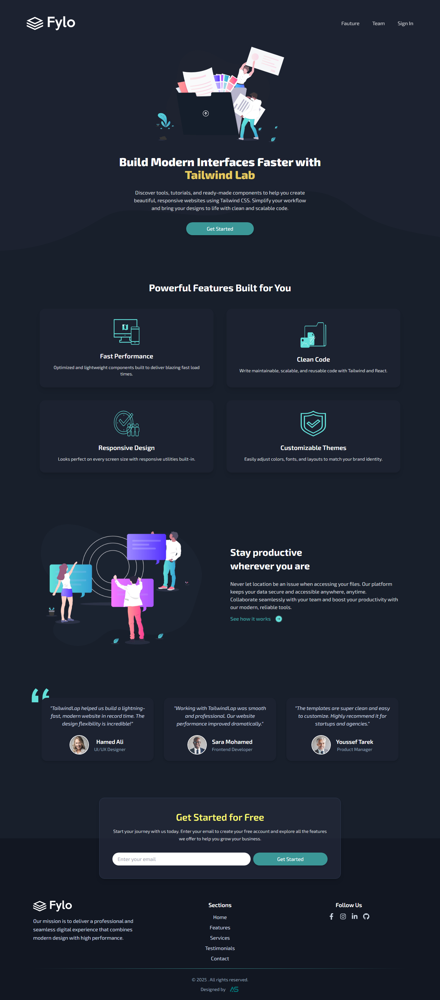

<h1 align="center">
  🌊 Tailwind-Land — Modern Responsive Website
</h1>

  <em>A sleek, fast, and fully responsive landing page built with <strong>React + Vite</strong> and styled using <strong style="color:#38bdf8;">Tailwind CSS</strong>.</em>

---

## 🎯 Overview

Tailwind-Land is a modern, responsive landing page designed to showcase the power of **utility-first CSS** with **Tailwind**.  
It combines **clean design**, **optimized performance**, and **reusable React components** to deliver a professional digital experience.

---

## 🚀 Features

✅ **Fast Performance** — Lightweight and blazing fast load times.  
🎨 **Modern UI Design** — Clean layouts with smooth animations.  
📱 **Fully Responsive** — Perfect across all devices.  
💡 **Interactive Animations** — Subtle transitions and hover effects.  
🧩 **Reusable Components** — Organized and easy to customize.

---

## 🛠️ Tech Stack

| Tool | Description |
|------|--------------|
| ⚛️ **React (Vite)** | Fast and modular front-end development |
| 🎨 **Tailwind CSS** | Utility-first styling for modern UIs |
| 🧠 **React Hooks** | useRef, useEffect for dynamic behavior |
| 💬 **React Icons** | Clean and scalable icon set |

---

## 🌈 Tailwind Skills Highlighted

💠 Responsive grid & flex layouts  
🎨 Custom theme configuration (colors, spacing, typography)  
✨ Transitions, hover effects, and animations  
🧱 Utility-first design approach  
🧩 Component-based architecture  

---

  

---

 © 2025 Tailwind-Land. All rights reserved. Built with ❤️ using React & Tailwind CSS. 
 